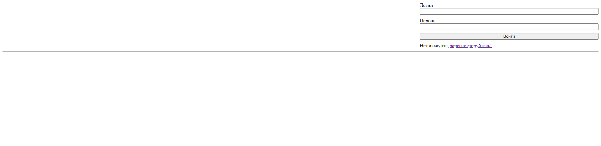
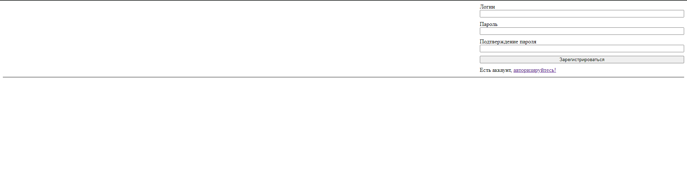
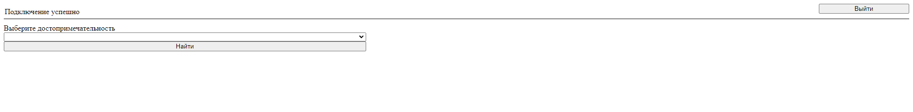
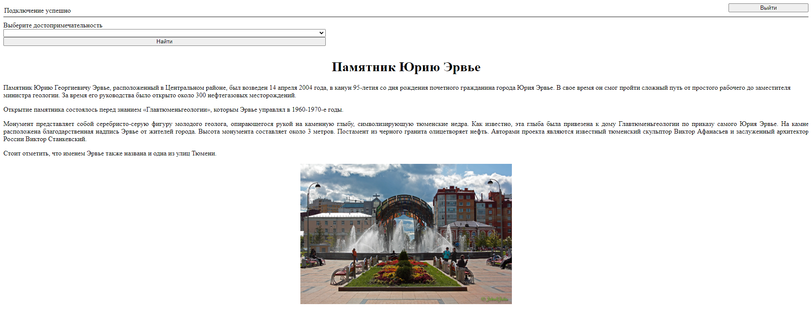
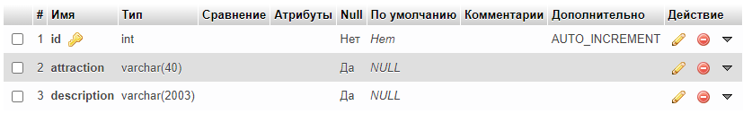
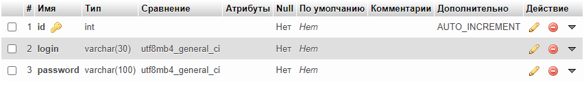

# Auth_and_Reg_using_sessions
Реализация авторизации и регистрации с помощью сессий и отображение статьи выбранной достопримечательности авторизированным пользователям

Страница authorization.php:

Страница registration.php:

Страница profile.php:

Страница profile.php при выборе достопримечательности:

Структура БД:
- Таблица attractions

- Таблица profile

---
*02/2023 - 06/2023*
